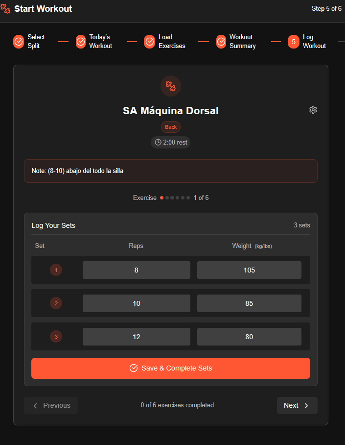

# Ehrgeizig LogBook

[](./LICENSE)
[](https://github.com/DereKk8/Ehrgeizig_LogBook/stargazers)
[](https://github.com/DereKk8/Ehrgeizig_LogBook/issues)
<!-- Replace with CI badge once you add a workflow -->
[](https://github.com/DereKk8/Ehrgeizig_LogBook/actions) 

> **Ehrgeizig LogBook** — a personal training log web app built with Next.js + TypeScript to track workouts, create custom routines with a guided wizard, and surface progress KPIs for bodybuilding and strength training.

🔗 Live demo: https://ehrgeizig-log-book.vercel.app/home

---

## TL;DR
Ehrgeizig LogBook helps you log workouts, build and reuse custom training routines (wizard-guided), and track progress with actionable KPIs (volume, frequency, progression). Built with Next.js + TypeScript + React; Supabase for auth & backend (recommended).

---

## Table of contents
- [Features](#features)  
- [Tech stack](#tech-stack)  
- [Screenshots](#screenshots)  
- [Getting started](#getting-started)  
- [Supabase setup](#supabase-setup)  
- [Usage & quick flows](#usage--quick-flows)  
- [KPIs the app produces](#kpis-the-app-produces)  
- [Contributing](#contributing)  
- [Roadmap](#roadmap)  
- [License & contact](#license--contact)

---

## Features
- Create an account and manage your user profile.  
- Guided wizard to create custom training routines (exercises, sets, reps, rest).  
- Log sets with weight/reps and automatic timestamping for each entry.  
- Progress KPIs (examples below): total volume, workout frequency, best lifts progression, PR tracking.  
- Clean, mobile-first UI and deploy-ready to Vercel.

---

## Tech stack
- **Frontend:** Next.js (App/Pages) + TypeScript + React  
- **Auth & Backend:** Supabase (email/password auth, Postgres DB)  
- **Deployment:** Vercel (production demo)  
- **CI / DX:** GitHub Actions (recommended), ESLint, Prettier, Husky

---

## Screenshots
> Replace these placeholders with real screenshots saved at `assets/` or `public/images/`.

  
*Profile — create routine wizard (timestamp: 2025-08-30 12:05)*

  
*Workout logging screen (timestamp: 2025-08-30 12:07)*

---

## Getting started (local dev)

### Prereqs
- Node.js 18+ (or recommended LTS)  
- pnpm / npm / yarn  
- A Supabase project (free tier OK)

### Clone & install
```bash
git clone https://github.com/DereKk8/Ehrgeizig_LogBook.git
cd Ehrgeizig_LogBook
cp .env.example .env.local          # fill env values
pnpm install                        # or `npm install` / `yarn`
